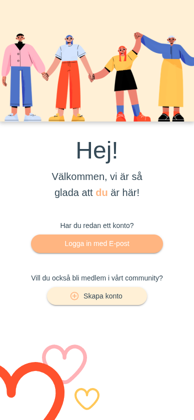
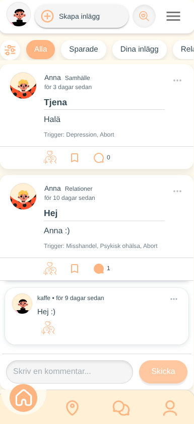
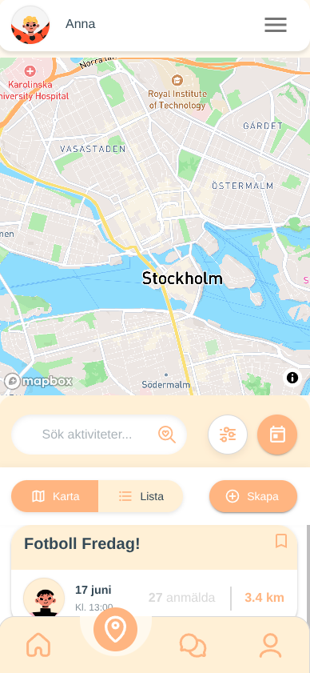
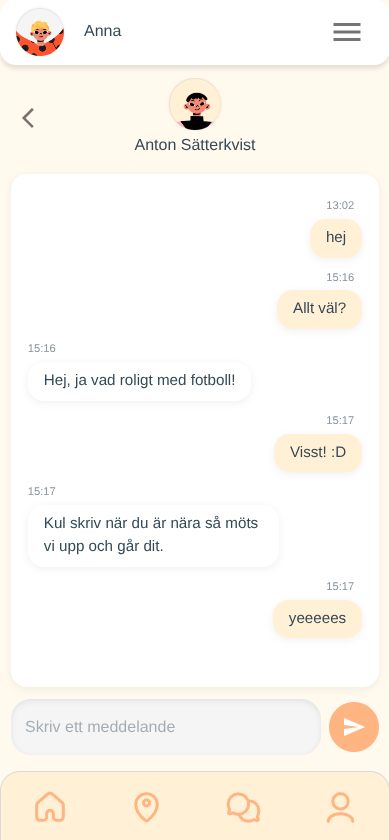
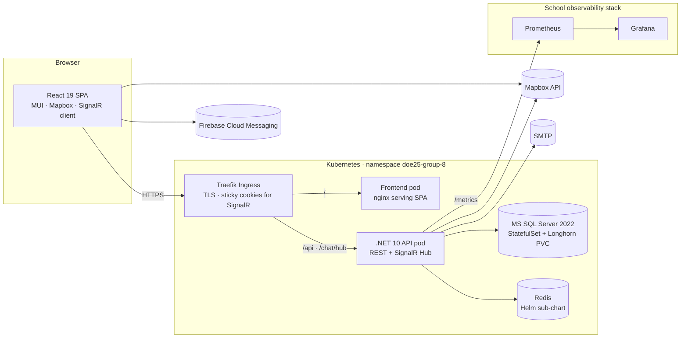
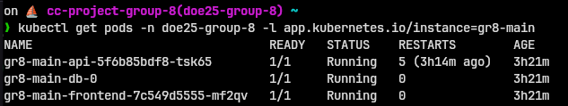
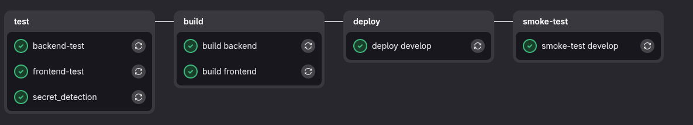
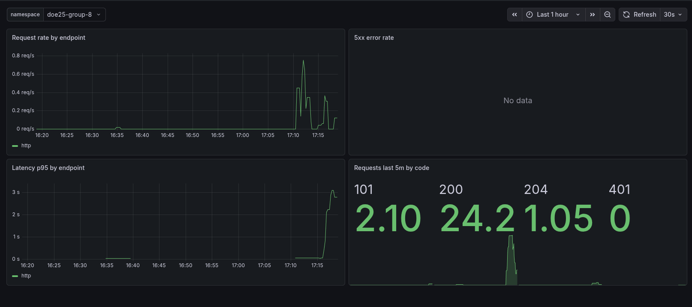

<div align="center">

# Mallo

**A place for community, conversation and connection — built by Group GR8.**

_A Swedish-language community platform where members share posts, find local activities on a map, and chat in real time._

<br />


<br />

[](https://git.chas-lab.dev/chas-challenge-2026/grupp-8/project/-/pipelines)


<br />

### → [Try it live at gr8-main.cc.k3s.chas-lab.dev](https://gr8-main.cc.k3s.chas-lab.dev/) ←

</div>

---

## What is Mallo?

Mallo is a Swedish-language web community. Members write posts, react with "hugs", comment, save favourites, and find real-world activities pinned to a map of Sweden. A built-in chat lets them message each other directly.

Under the hood: **React 19** in the browser, a **.NET 10** API, **MS SQL Server 2022**, **SignalR** for realtime, **Mapbox** for the maps. Everything runs in containers on the school's **Kubernetes** cluster, deployed by GitLab CI.

We built this as Grupp GR8's submission for **Chas Challenge 2026** at [Chas Academy](https://chasacademy.se).

---

## What it looks like

<div align="center">

<table>
<tr>
<td align="center"><br/><sub><b>Welcome & login</b></sub></td>
<td align="center"><br/><sub><b>Forum feed</b></sub></td>
<td align="center"><br/><sub><b>Activity map</b></sub></td>
<td align="center"><br/><sub><b>Real-time chat</b></sub></td>
</tr>
</table>

<sub>Mobile views. Mallo is built mobile-first.</sub>

</div>

---

## Features

| Area | What it does | Where it lives |
|---|---|---|
| **Forum** | Posts with titles, categories (13 themes), tags (20), threaded comments, hugs (reactions), bookmarks, and user-driven reports for moderation. | [`backend/Gr8/Api/Endpoints/CommunityEndpoints.cs`](backend/Gr8/Api/Endpoints/CommunityEndpoints.cs) · [`frontend/Gr8/src/pages/forum`](frontend/Gr8/src/pages/forum) |
| **Activity map** | Geo-tagged events with images, date ranges, and addresses, browsable on an interactive Mapbox map. Distance helpers (Turf.js) power proximity filtering. | [`backend/Gr8/Api/Endpoints/ActivityEndpoints.cs`](backend/Gr8/Api/Endpoints/ActivityEndpoints.cs) · [`frontend/Gr8/src/components/activity/map`](frontend/Gr8/src/components/activity/map) |
| **Real-time chat** | One-to-one direct messages over a SignalR WebSocket hub. Typing indicators, read-receipts, per-user soft-delete, auto-reconnect. | [`backend/Gr8/Api/Endpoints/ChatEndpoints.cs`](backend/Gr8/Api/Endpoints/ChatEndpoints.cs) · [`frontend/Gr8/src/services/ChatSignalrServices.jsx`](frontend/Gr8/src/services/ChatSignalrServices.jsx) |
| **Accounts & auth** | Register (with Swedish personnummer + 18+ check), login, JWT bearer tokens, email-based password reset (MailKit/SMTP), profile editing, account deletion (GDPR). | [`backend/Gr8/Api/Endpoints/IdentityEndpoints.cs`](backend/Gr8/Api/Endpoints/IdentityEndpoints.cs) |
| **Push notifications** | Firebase Cloud Messaging service-worker in the browser for activity / chat alerts. | [`frontend/Gr8/public/firebase-messaging-sw.js`](frontend/Gr8/public/firebase-messaging-sw.js) |
| **API docs** | Live OpenAPI schema served by the API; Scalar UI for interactive browsing. | `GET /api/openapi/v1.json` on every environment |

---

## Architecture



The SPA and API deploy separately so they can scale on their own. The API doesn't keep sessions in memory (auth is just a JWT), so we could run more than one replica if we ever need to. SignalR connections get pinned to a single pod via a sticky cookie at the ingress, which keeps chat from dropping when that happens. MSSQL is the only thing with durable state worth worrying about: StatefulSet, Longhorn PVC. Redis (sub-chart) has a small PVC too, but it's just cache.

---

## Backend (.NET 10, Clean Architecture)

Four .NET projects in the classic Clean Architecture layering:

```
backend/Gr8/
├── Domain/           # Entities + business invariants. Knows nothing about EF or HTTP.
├── Application/      # Services, DTOs, repository interfaces. Pure orchestration.
├── Infrastructure/   # EF Core, repositories, JWT, email, Mapbox client.
└── Api/              # Minimal-API endpoints, middleware, SignalR hub, Program.cs.
```

| Detail | Value |
|---|---|
| Runtime | .NET 10.0 |
| ORM | EF Core 10.0.7 (SQL Server provider) |
| Auth | ASP.NET Core Identity + JWT bearer (HS256) |
| Realtime | SignalR (Hub at `/chat/hub`, JWT via query string for the WS handshake) |
| API style | Minimal APIs, grouped into `*Endpoints.cs` files |
| Email | MailKit over SMTP (password reset) |
| Maps | HttpClient against Mapbox geocoding API |
| Docs | OpenAPI + Scalar UI |
| Metrics | `prometheus-net` exposed on `/metrics` |
| Persistence | Two `DbContext`s: `ApplicationDbContext` (Identity, 7 migrations) and `CommunityDbContext` (domain, 21 migrations). Categories (13) and tags (20) seeded via EF `HasData` in `CommunityDbContext`. |

### A few notes

- **Two DbContexts.** We keep Identity tables separate from the domain tables so the auth schema and the app schema can evolve independently without their migrations stepping on each other.
- **Repository pattern** (`ICommunityRepository`, `IApplicationRepository`, `IChatRepository`) sits between the services and EF, so the Application layer can be tested without a real database.
- **No MVC controllers.** We use minimal-API endpoints grouped one file per area: `Identity`, `Community`, `Activity`, `Chat`.
- **Migrations run on startup.** The CI smoke test (see [CI/CD](#cicd-pipeline)) waits long enough to cover a cold MSSQL pod re-applying the schema after a deploy.

---

## Frontend (React 19, Vite)

```
frontend/Gr8/src/
├── pages/         # Route-level pages (landing, login, register, home, settings, chat, ...)
├── components/    # Feature components (postCard, chat, activity/map, activity/calendar, ...)
├── design/        # Reusable buttons, inputs, Theme
├── contexts/      # AuthContext (JWT in localStorage, 401 auto-logout)
├── services/      # API service wrappers (PostServices, ChatService, ActivityService, ...)
├── api/           # axios client with bearer-token interceptor
└── assets/        # Hearts, illustrations, icons
```

| Detail | Value |
|---|---|
| Framework | React 19.2 + Vite 8 |
| Routing | react-router-dom v7 |
| UI library | MUI v9 (`@mui/material`, `@mui/icons-material`, `@mui/x-date-pickers`) |
| Styling | Emotion (MUI's CSS-in-JS) + scoped component CSS + CSS custom properties in [`src/index.css`](frontend/Gr8/src/index.css) |
| Maps | `mapbox-gl` + `react-map-gl` + `@turf/distance` for clustering / proximity |
| Realtime | `@microsoft/signalr` |
| HTTP | axios wrapper with JWT bearer interceptor |
| Dates | `dayjs` + `moment` (`sv` locale) |
| Language | Swedish (no i18n layer; strings live in the components) |
| Push notifications | Firebase Cloud Messaging service worker |

The production build is served by nginx with an SPA fallback (`try_files $uri $uri/ /index.html`). Full config in [`frontend/Gr8/nginx.conf`](frontend/Gr8/nginx.conf).

---

## Deploy & infrastructure

Everything ships to the school's **Kubernetes** cluster (a [k3s](https://k3s.io/) distribution: same APIs as upstream, just a smaller install) at `*.cc.k3s.chas-lab.dev`, namespace `doe25-group-8`.

We split the deploy in two:

| Component | Deployed as | Why |
|---|---|---|
| Frontend, API, MSSQL | Plain k8s YAML in [`devops/k8s/manifests/`](devops/k8s/manifests/) | Anyone can read a `Deployment` without learning Helm templating first. |
| Redis + observability glue | Helm chart in [`devops/k8s/chart/`](devops/k8s/chart/) | Redis is a versioned upstream dependency (Bitnami sub-chart). The observability pieces (`ServiceMonitor`, `PrometheusRule`, Grafana dashboard ConfigMap) benefit from Helm's templating for release naming. |

### Branches → environments

| Branch | Image tag | URL | Notes |
|---|---|---|---|
| `main` | `:latest` | `https://gr8-main.cc.k3s.chas-lab.dev/` | **Manual approval gate in CI.** Persistent DB. |
| `develop` | `:develop` | `https://gr8-develop.cc.k3s.chas-lab.dev/` | Auto-deploy on push. Persistent DB. |
| `feature/<slug>` | `:<slug>` | _Not auto-deployed_ | The images get built so anyone can pull them, but they don't auto-deploy. To see a feature branch live, deploy it locally or merge into develop. |

The manifests bake in `gr8-plain` as a placeholder name. At deploy time, CI rewrites it (`sed -i 's|gr8-plain|gr8-<env>|g'`) to the per-environment release name. Production also rewrites image tags from `:develop` to `:latest`.



### CI/CD pipeline



| Stage | Highlights |
|---|---|
| **test** | `check-merge-source` enforces *only `develop` can merge into `main`*. Frontend/backend test jobs are placeholders awaiting Jest/xUnit suites. |
| **secret-detection** | GitLab's built-in template, runs on every pipeline. |
| **build** | Docker buildx with registry cache. Images pushed to `registry.chas-lab.dev/.../backend:<tag>` and `.../frontend:<tag>`. |
| **deploy** | Applies the rewritten manifests, then `kubectl rollout restart` on the API + frontend deployments to force a pull even when the tag is unchanged. `helm upgrade --install` for Redis + observability. |
| **smoke-test** | Polls `${ENV_URL}/api/openapi/v1.json` every 5s for 5 minutes. Any HTTP response counts as success. Only gateway errors (502/503/504) and connection failures count as down. 5 minutes is enough to cover MSSQL cold-starting and EF re-applying the schema, which takes around 3–4 min after a fresh pod. |

Workflow rules make sure there's exactly one pipeline per commit. If an MR is open, only the MR pipeline runs (so deploy + smoke-test gate the merge button). Otherwise the branch pipeline runs.

### Secrets

Secrets live in two plain Kubernetes `Secret` objects: `gr8-secrets` for app secrets, `gitlab-registry` for the image pull secret. We create them once with `kubectl create secret` when bootstrapping a namespace. CI never templates them and they never land in the repo. Bootstrap steps are in [`devops/k8s/`](devops/k8s/).

---

## Observability

The school cluster already runs Prometheus + Grafana. Our Helm chart adds Mallo-specific pieces on top:

- **`ServiceMonitor`** scrapes the API's `/metrics` endpoint every 15s.
- **`PrometheusRule`** with two alerts:
  - `Gr8ApiHighErrorRate`: 5xx rate above 5% for 5 min (warning)
  - `Gr8ApiNoTraffic`: 0 req/s for 15 min (info)
- **Grafana dashboard** auto-provisioned by a ConfigMap (label `grafana_dashboard: "1"`). Four panels: request rate by endpoint, 5xx rate, p95 latency by endpoint, request count by HTTP status code.



Templates: [`devops/k8s/chart/templates/`](devops/k8s/chart/templates/).

---

## Live environments

| Environment | URL |
|---|---|
| Production (`main`) | <https://gr8-main.cc.k3s.chas-lab.dev/> |
| Staging (`develop`) | <https://gr8-develop.cc.k3s.chas-lab.dev/> |
| API docs (prod) | <https://gr8-main.cc.k3s.chas-lab.dev/api/openapi/v1.json> |

---

## Run it locally

For local dev, run MSSQL in Docker and start the API and frontend each in their own terminal.

```bash
# 1. MS SQL Server in a container.
docker run -d --name mallo-db \
  -e ACCEPT_EULA=Y -e MSSQL_SA_PASSWORD='YourStrong!Password123' \
  -p 1433:1433 mcr.microsoft.com/mssql/server:2022-latest

# 2. Backend. First time only: store the connection string in user-secrets.
cd backend/Gr8
dotnet user-secrets --project Api set \
  "ConnectionStrings:DefaultConnection" \
  "Server=localhost;Database=CommunityDB;User Id=sa;Password=YourStrong!Password123;TrustServerCertificate=true"
dotnet run --project Api          # → http://localhost:5225 (EF migrations run on startup)

# 3. Frontend, in a second terminal.
cd frontend/Gr8
echo "VITE_API_BASE_URL=http://localhost:5225" > .env.local
echo "VITE_MAPBOX_TOKEN=<your-mapbox-token>"  >> .env.local
npm install
npm run dev                       # → http://localhost:5173
```

Open `http://localhost:5173`. The API exposes OpenAPI at `http://localhost:5225/openapi/v1.json`.

For Rider / Visual Studio: open [`backend/Gr8/Gr8.slnx`](backend/Gr8/Gr8.slnx).

---

## Project structure

```
.
├── backend/Gr8/              # .NET 10 solution (Domain / Application / Infrastructure / Api)
├── frontend/Gr8/             # React 19 + Vite SPA
├── devops/
│   ├── k8s/manifests/        # Plain YAML for api / frontend / db / ingress / middleware
│   ├── k8s/chart/            # Helm chart: Redis + observability (ServiceMonitor, PrometheusRule, dashboard)
│   └── README.md
├── docs/media/               # Demo videos and screenshots referenced from this README
├── .gitlab-ci.yml            # Build, deploy, smoke-test pipeline
└── README.md                 # You are here.
```

---

## Team GR8

| Member | Role |
|---|---|
| [Daniel Hultmark](https://www.linkedin.com/in/daniel-hultmark-666b7113a/) | .NET Fullstack |
| [Elina Jonsson](https://www.linkedin.com/in/elina-jonsson-904bba383/) | .NET Fullstack |
| [Jonna Barvsten](https://www.linkedin.com/in/jonna-barvsten/) | .NET Fullstack |
| [Sebastian Enerstrand](https://www.linkedin.com/in/sebastian-enerstrand-393aba17b/) | .NET Fullstack |
| [Victoria Lindén](https://www.linkedin.com/in/victoria-linden/) | .NET Fullstack |
| Chipego Elikya Liambi | Frontend |
| [Jennifer Gahne](https://www.linkedin.com/in/jennifer-gahne-797321382/) | UX |
| [Anton Sätterkvist](https://www.linkedin.com/in/anton-satterkvist/) | DevOps |
| [Reza Damavandi](https://www.linkedin.com/in/reza-damavandi/) | DevOps |

Branch naming follows the team's Jira project (`UT8`) when there's a ticket (`feature/UT8-367_style_card_image_url`). When there isn't, we use descriptive names like `feature/fix-api-inotify-crash`.

---

## Acknowledgements

Built at **[Chas Academy](https://chasacademy.se)** as part of **Chas Challenge 2026**. Deployed on the school's Kubernetes cluster.
