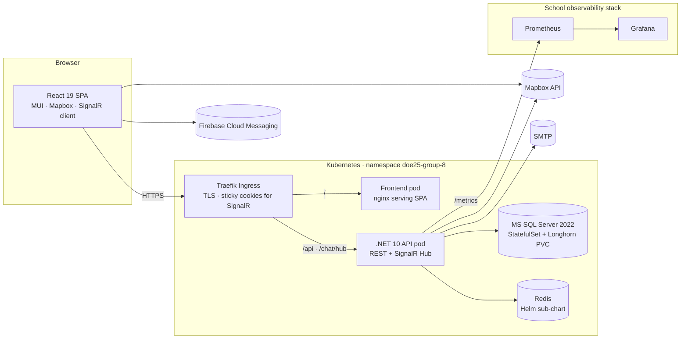
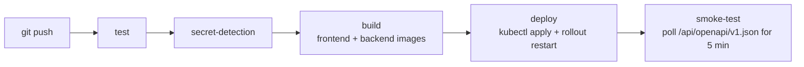

<div align="center">

# Mallo

**En plats för community, samtal och möten — byggd av Grupp GR8.**

_A Swedish-language community platform where members share posts, find local activities on a map, and chat in real time._

<br />


<br />

[](https://git.chas-lab.dev/chas-challenge-2026/grupp-8/project/-/pipelines)


</div>

---

## For the reader in a hurry

| You are a... | Start here |
|---|---|
| **Judge / teacher reviewing the project** | [What is Mallo?](#what-is-mallo) → [Features](#features) → [Live environments](#live-environments) |
| **.NET reviewer** (backend / fullstack) | [Architecture](#architecture) → [Backend deep-dive](#backend--net-10--clean-architecture) → [`backend/Gr8/`](backend/Gr8/) |
| **DevOps reviewer** | [Deploy & infrastructure](#deploy--infrastructure) → [CI/CD pipeline](#cicd-pipeline) → [Observability](#observability) → [`devops/`](devops/) |
| **Anyone who wants to run it** | [Run it locally](#run-it-locally) |

---

## What is Mallo?

Mallo is a Swedish-language web community. Members create posts, react with "hugs", comment, save favourites, and discover real-world activities pinned to a map of Sweden. A built-in real-time chat lets members reach out to each other one-to-one.

The product is built as a fullstack web app — **React 19** in the browser, a **.NET 10** API on the server, **MS SQL Server 2022** for persistence, **SignalR** for realtime, **Mapbox** for geography. Everything is containerised and deployed to the school's **Kubernetes** cluster by GitLab CI.

This repository is **Grupp GR8**'s submission for **Chas Challenge 2026** at [Chas Academy](https://chasacademy.se).

---

## What it looks like

<div align="center">

<table>
<tr>
<td align="center"><br/><sub><b>Welcome & login</b></sub></td>
<td align="center"><br/><sub><b>Forum feed</b></sub></td>
<td align="center"><br/><sub><b>Activity map</b></sub></td>
<td align="center"><br/><sub><b>Real-time chat</b></sub></td>
</tr>
</table>

<sub>Mobile views — Mallo is built mobile-first.</sub>

</div>

---

## Features

| Area | What it does | Where it lives |
|---|---|---|
| **Forum** | Posts with titles, categories (13 themes), tags (20), threaded comments, hugs (reactions), bookmarks, and user-driven reports for moderation. | [`backend/Gr8/Api/Endpoints/CommunityEndpoints.cs`](backend/Gr8/Api/Endpoints/CommunityEndpoints.cs) · [`frontend/Gr8/src/pages/forum`](frontend/Gr8/src/pages/forum) |
| **Activity map** | Geo-tagged events with images, date ranges, and addresses, browsable on an interactive Mapbox map. Distance helpers (Turf.js) power proximity filtering. | [`backend/Gr8/Api/Endpoints/ActivityEndpoints.cs`](backend/Gr8/Api/Endpoints/ActivityEndpoints.cs) · [`frontend/Gr8/src/components/activity/map`](frontend/Gr8/src/components/activity/map) |
| **Real-time chat** | One-to-one direct messages over a SignalR WebSocket hub. Typing indicators, read-receipts, per-user soft-delete, auto-reconnect. | [`backend/Gr8/Api/Endpoints/ChatEndpoints.cs`](backend/Gr8/Api/Endpoints/ChatEndpoints.cs) · [`frontend/Gr8/src/services/ChatSignalrServices.jsx`](frontend/Gr8/src/services/ChatSignalrServices.jsx) |
| **Accounts & auth** | Register (with Swedish personnummer + 18+ check), login, JWT bearer tokens, email-based password reset (MailKit/SMTP), profile editing, account deletion (GDPR). | [`backend/Gr8/Api/Endpoints/IdentityEndpoints.cs`](backend/Gr8/Api/Endpoints/IdentityEndpoints.cs) |
| **Push notifications** | Firebase Cloud Messaging service-worker in the browser for activity / chat alerts. | [`frontend/Gr8/public/firebase-messaging-sw.js`](frontend/Gr8/public/firebase-messaging-sw.js) |
| **API docs** | Live OpenAPI schema served by the API; Scalar UI for interactive browsing. | `GET /api/openapi/v1.json` on every environment |

---

## Architecture



**Why this shape:** the SPA and API are deployed and scaled independently. The API stays stateless (auth via JWT, no in-memory sessions); SignalR connections are pinned with a sticky-session cookie at the ingress so realtime chat survives multi-replica scale-out. MS SQL holds the durable application data as a `StatefulSet` with a Longhorn PVC; Redis (sub-chart) has its own smaller PVC for cache state.

---

## Backend — .NET 10 / Clean Architecture

The backend is a four-project .NET solution following the classic **Clean Architecture** layering:

```
backend/Gr8/
├── Domain/           # Entities + business invariants. Knows nothing about EF or HTTP.
├── Application/      # Services, DTOs, repository interfaces. Pure orchestration.
├── Infrastructure/   # EF Core, repositories, JWT, email, Mapbox client.
└── Api/              # Minimal-API endpoints, middleware, SignalR hub, Program.cs.
```

| Detail | Value |
|---|---|
| Runtime | .NET 10.0 |
| ORM | EF Core 10.0.7 (SQL Server provider) |
| Auth | ASP.NET Core Identity + JWT bearer (HS256) |
| Realtime | SignalR (Hub at `/chat/hub`, JWT via query string for the WS handshake) |
| API style | Minimal APIs, grouped into `*Endpoints.cs` files |
| Email | MailKit over SMTP (password reset) |
| Maps | HttpClient against Mapbox geocoding API |
| Docs | OpenAPI + Scalar UI |
| Metrics | `prometheus-net` exposed on `/metrics` |
| Persistence | Two `DbContext`s: `ApplicationDbContext` (Identity, 7 migrations) and `CommunityDbContext` (domain, 21 migrations). Categories (13) and tags (20) seeded via EF `HasData` in `CommunityDbContext`. |

### Notable design choices

- **Two DbContexts** keep the auth / Identity tables separate from the domain tables — easier to reason about migrations and to evolve each independently.
- **Repository pattern** (`ICommunityRepository`, `IApplicationRepository`, `IChatRepository`) sits between services and EF so the Application layer is testable without a database.
- **Endpoint grouping** instead of MVC controllers — minimal-API style, one file per bounded context (`Identity`, `Community`, `Activity`, `Chat`).
- **Automatic migrations on startup** in dev; the smoke test (see [CI/CD](#cicd-pipeline)) waits long enough to cover a cold-start schema upgrade against a freshly-rolled MSSQL pod.

---

## Frontend — React 19 / Vite

```
frontend/Gr8/src/
├── pages/         # Route-level pages (landing, login, register, home, settings, chat, ...)
├── components/    # Feature components (postCard, chat, activity/map, activity/calendar, ...)
├── design/        # Reusable buttons, inputs, Theme
├── contexts/      # AuthContext (JWT in localStorage, 401 auto-logout)
├── services/      # API service wrappers (PostServices, ChatService, ActivityService, ...)
├── api/           # axios client with bearer-token interceptor
└── assets/        # Hearts, illustrations, icons
```

| Detail | Value |
|---|---|
| Framework | React 19.2 + Vite 8 |
| Routing | react-router-dom v7 |
| UI library | MUI v9 (`@mui/material`, `@mui/icons-material`, `@mui/x-date-pickers`) |
| Styling | Emotion (MUI's CSS-in-JS) + scoped component CSS + CSS custom properties in [`src/index.css`](frontend/Gr8/src/index.css) |
| Maps | `mapbox-gl` + `react-map-gl` + `@turf/distance` for clustering / proximity |
| Realtime | `@microsoft/signalr` |
| HTTP | axios wrapper with JWT bearer interceptor |
| Dates | `dayjs` + `moment` (`sv` locale) |
| Language | Swedish (no i18n layer — strings live in components) |
| Push notifications | Firebase Cloud Messaging service worker |

The production build is served by nginx with an SPA fallback (`try_files $uri $uri/ /index.html`) — see [`frontend/Gr8/nginx.conf`](frontend/Gr8/nginx.conf).

---

## Deploy & infrastructure

Everything ships to the school's **Kubernetes** cluster — a [k3s](https://k3s.io/) distribution, CNCF-certified, same APIs as upstream — at `*.cc.k3s.chas-lab.dev`, namespace `doe25-group-8`. The deploy shape is a deliberate hybrid:

| Component | Deployed as | Why |
|---|---|---|
| Frontend, API, MSSQL | Plain k8s YAML in [`devops/k8s/manifests/`](devops/k8s/manifests/) | Simple, transparent — every reviewer can read a `Deployment` without learning Helm templating. |
| Redis + observability glue | Helm chart in [`devops/k8s/chart/`](devops/k8s/chart/) | Redis is a versioned upstream dependency (Bitnami). Observability (ServiceMonitor, PrometheusRule, Grafana dashboard ConfigMap) benefits from Helm's templating for release naming. |

### Branches → environments

| Branch | Image tag | URL | Notes |
|---|---|---|---|
| `main` | `:latest` | `https://gr8-main.cc.k3s.chas-lab.dev/` | **Manual approval gate in CI.** Persistent DB. |
| `develop` | `:develop` | `https://gr8-develop.cc.k3s.chas-lab.dev/` | Auto-deploy on push. Persistent DB. |
| `feature/<slug>` | `:<slug>` | _Not auto-deployed_ | Images are built so anyone can pull them; deploy locally or merge to develop to see them live. |

`gr8-plain` is the placeholder name baked into the manifests; CI rewrites it (`sed -i 's|gr8-plain|gr8-<env>|g'`) to produce the per-environment release name. Production additionally rewrites image tags (`backend:develop` → `backend:latest`).

### CI/CD pipeline



| Stage | Highlights |
|---|---|
| **test** | `check-merge-source` enforces *only `develop` can merge into `main`*. Frontend/backend test jobs are placeholders awaiting Jest/xUnit suites. |
| **secret-detection** | GitLab's built-in template, runs on every pipeline. |
| **build** | Docker buildx with registry cache. Images pushed to `registry.chas-lab.dev/.../backend:<tag>` and `.../frontend:<tag>`. |
| **deploy** | Applies the rewritten manifests, then `kubectl rollout restart` on the API + frontend deployments to force a pull even when the tag is unchanged. `helm upgrade --install` for Redis + observability. |
| **smoke-test** | Polls `${ENV_URL}/api/openapi/v1.json` every 5s for 5 minutes. Any non-5xx is success; only gateway errors and connection failures count as down. Window is sized to cover an MSSQL cold start + EF schema upgrade (3–4 min). |

Workflow rules guarantee exactly one pipeline per commit: when an MR is open, only the MR pipeline runs (so deploy + smoke-test become part of the merge gate); otherwise the branch pipeline runs.

### Secrets

Secrets are plain Kubernetes `Secret` objects (`gr8-secrets` for app secrets, `gitlab-registry` for the image pull secret), created **out of band** with `kubectl create secret` — never templated by CI, never committed. The cluster bootstrap is documented in [`devops/k8s/`](devops/k8s/).

---

## Observability

The school cluster already runs Prometheus + Grafana. Mallo plugs into them via the Helm chart:

- **`ServiceMonitor`** scrapes the API's `/metrics` endpoint every 15s.
- **`PrometheusRule`** ships two alerts:
  - `Gr8ApiHighErrorRate` — 5xx rate > 5% for 5 min (warning)
  - `Gr8ApiNoTraffic` — 0 req/s for 15 min (info)
- **Grafana dashboard** auto-provisioned via ConfigMap (label `grafana_dashboard: "1"`). Four panels: request rate by endpoint, 5xx rate, p95 latency by endpoint, request count by HTTP status code.

<div align="center">

</div>

Templates: [`devops/k8s/chart/templates/`](devops/k8s/chart/templates/).

---

## Live environments

| Environment | URL |
|---|---|
| Production (`main`) | <https://gr8-main.cc.k3s.chas-lab.dev/> |
| Staging (`develop`) | <https://gr8-develop.cc.k3s.chas-lab.dev/> |
| API docs (prod) | <https://gr8-main.cc.k3s.chas-lab.dev/api/openapi/v1.json> |

---

## Run it locally

The fastest path: run MSSQL in Docker, then the API and frontend each in their own terminal. The root `docker-compose.yml` is shaped for the cluster deploy, not for local dev.

```bash
# 1. MS SQL Server in a container.
docker run -d --name mallo-db \
  -e ACCEPT_EULA=Y -e MSSQL_SA_PASSWORD='YourStrong!Password123' \
  -p 1433:1433 mcr.microsoft.com/mssql/server:2022-latest

# 2. Backend — first time, set the connection string via user-secrets.
cd backend/Gr8
dotnet user-secrets --project Api set \
  "ConnectionStrings:DefaultConnection" \
  "Server=localhost;Database=CommunityDB;User Id=sa;Password=YourStrong!Password123;TrustServerCertificate=true"
dotnet run --project Api          # → http://localhost:5225 (EF migrations run on startup)

# 3. Frontend — in another terminal.
cd frontend/Gr8
echo "VITE_API_BASE_URL=http://localhost:5225" > .env.local
echo "VITE_MAPBOX_TOKEN=<your-mapbox-token>"  >> .env.local
npm install
npm run dev                       # → http://localhost:5173
```

Open `http://localhost:5173`. The API exposes OpenAPI at `http://localhost:5225/openapi/v1.json`.

For Rider / Visual Studio: open [`backend/Gr8/Gr8.slnx`](backend/Gr8/Gr8.slnx).

---

## Project structure

```
.
├── backend/Gr8/              # .NET 10 solution (Domain / Application / Infrastructure / Api)
├── frontend/Gr8/             # React 19 + Vite SPA
├── devops/
│   ├── k8s/manifests/        # Plain YAML for api / frontend / db / ingress / middleware
│   ├── k8s/chart/            # Helm chart: Redis + observability (ServiceMonitor, PrometheusRule, dashboard)
│   ├── swarm-setup.md        # Historical: previous Docker Swarm setup (now retired)
│   └── README.md
├── docs/media/               # Demo videos and screenshots referenced from this README
├── docker-compose.yml        # Legacy Docker Swarm composition — kept for reference, not used for local dev or current deploy
├── .gitlab-ci.yml            # Build, deploy, smoke-test pipeline
├── TECHSTACK.md              # Pinned framework / language versions
└── README.md                 # You are here.
```

---

## Team — Grupp GR8

| Member | Role |
|---|---|
| Daniel | .NET Fullstack |
| Elina | .NET Fullstack |
| Jonna | .NET Fullstack |
| Sebastian | .NET Fullstack |
| Victoria | .NET Fullstack |
| Chipego | Frontend |
| Jennifer | UX |
| Anton | DevOps |
| Reza | DevOps |

Branch naming follows the team's Jira project (`UT8`) when a ticket exists — e.g. `feature/UT8-367_style_card_image_url` — and descriptive names (`feature/fix-api-inotify-crash`) for ticketless work.

---

## Acknowledgements

Built at **[Chas Academy](https://chasacademy.se)** as part of **Chas Challenge 2026**. Deployed on the school's Kubernetes cluster.
